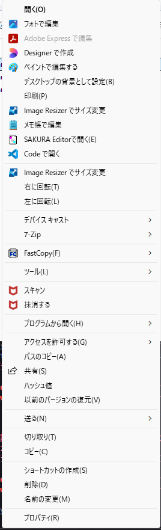
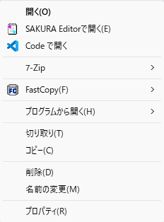
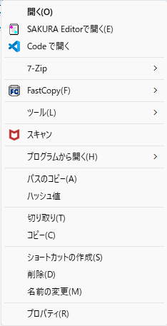

## ContextMenuHide
[jp]
* Windows 10 方式のエクスプローラの右クリックメニューから設定したメニューを非表示にします。
* Windows 11 方式の新しい見た目の右クリックメニューには対応していません。
* 右クリックメニューの高速化ではありません。高速化したい場合はいらないアプリのアンインストールやShellExtentionによる設定オフを薦めます。
[en]
* Hides the menu you configure from the right-click menu in Windows 10-style File Explorer.
* Does not support the new-look right-click menu in Windows 11.
* This does not speed up the right-click menu. If you want to speed it up, we recommend uninstalling unnecessary apps or disabling settings via ShellExtension.

### インストール方法 (Installation Instructions):
[jp]
* どこか適当に解凍してください。
* インストーラはありません。レジストリにも書き込まれません。
* スタートアップへは各自でショートカットを登録してください。
* 32bit版はテストされていません。Vista以降で動くとは思うのですが・・・。
[en]
* There is no installer. No entries are written to the registry.
* Please add a shortcut to the Startup folder yourself.
* The 32-bit version has not been tested. I believe it should work on Vista and later versions, though...

### アンインストール方法 (Uninstallation):
[jp]
* フォルダ毎削除してください。
* 削除できない場合はWindowsを再起動してみてください。
[en]
Please delete the entire folder.
If you cannot delete it, try restarting Windows.

### 使用方法 (Usage):
[jp]
1. 以下を実行してください。
   * 64bit Windows : ContextMenuHide64.exe
   * 32bit Windows : ContextMenuHide86.exe
2. 現在設定画面がないため、blocklist.jsonをテキストエディタで修正してください
3. blocklist.jsonの記載方法
   * { "hide_all": true, "text": "MD5値をコピー(&M)" },
   * hide_all : true だと右クリック時、シフト＋右クリック時の両方で消えます。
   * hide_all : false だと右クリック時のみで消えます。シフト＋右クリック時は表示されます。
   * "text"への記載はContextMenuSpy**.exeで表示される文字列で記載してください
   * 同じtextのメニューは全て消えてしまいます。
4. ちなみにCtrl+クリックをすると全て表示します。
[en]
1. Run the following:
   * 64-bit Windows: ContextMenuHide64.exe
   * 32-bit Windows: ContextMenuHide86.exe
2. Since there is currently no settings screen, please edit blocklist.json using a text editor
3. How to edit blocklist.json
   * { “hide_all”: true, ‘text’: “Copy MD5 value (&M)” },
   * If hide_all is set to true, the menu will be hidden for both right-clicks and Shift+right-clicks.
   * If hide_all is set to false, the menu will be hidden only for right-clicks. It will appear for Shift+right-clicks.
   * For the “text” entry, please use the exact string displayed in ContextMenuSpy**.exe
   * Any menu items with the same text will be hidden.
4. Note: Pressing Ctrl+click will display all menu items.

### 終了方法 (How to exit):
[jp]
* タスクトレイアイコンから終了してください
[en]
* Please exit via the taskbar icon

### 動作画像 (Screenshots)
| Original | Right Click | Shift + Right Click |
|---|---|---|
|  |  |  |

